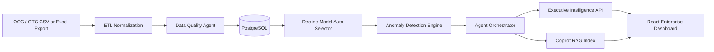
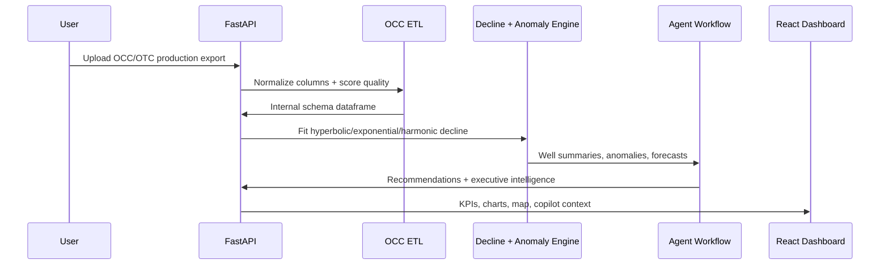
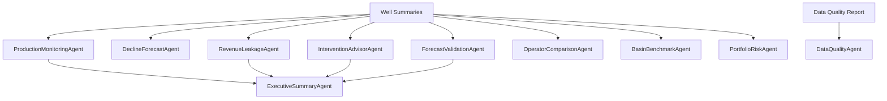

# WellGuard AI Phase 2 Architecture

```mermaid
flowchart LR
  A[OCC / OTC CSV or Excel Export] --> B[ETL Normalization]
  B --> C[Data Quality Agent]
  C --> D[(PostgreSQL)]
  D --> E[Decline Model Auto Selector]
  E --> F[Anomaly Detection Engine]
  F --> G[Agent Orchestrator]
  G --> H[Executive Intelligence API]
  G --> I[Copilot RAG Index]
  H --> J[React Enterprise Dashboard]
  I --> J
```

## Model Flow

```mermaid
sequenceDiagram
  participant User
  participant API as FastAPI
  participant ETL as OCC ETL
  participant ML as Decline + Anomaly Engine
  participant Agents as Agent Workflow
  participant UI as React Dashboard

  User->>API: Upload OCC/OTC production export
  API->>ETL: Normalize columns + score quality
  ETL->>API: Internal schema dataframe
  API->>ML: Fit hyperbolic/exponential/harmonic decline
  ML->>Agents: Well summaries, anomalies, forecasts
  Agents->>API: Recommendations + executive intelligence
  API->>UI: KPIs, charts, map, copilot context
```

## Agent Workflow

```mermaid
flowchart TB
  W[Well Summaries] --> PM[ProductionMonitoringAgent]
  W --> DF[DeclineForecastAgent]
  W --> RL[RevenueLeakageAgent]
  W --> IA[InterventionAdvisorAgent]
  W --> FV[ForecastValidationAgent]
  W --> OC[OperatorComparisonAgent]
  W --> BB[BasinBenchmarkAgent]
  W --> PR[PortfolioRiskAgent]
  Q[Data Quality Report] --> DQ[DataQualityAgent]
  PM --> ES[ExecutiveSummaryAgent]
  RL --> ES
  IA --> ES
  FV --> ES
```
